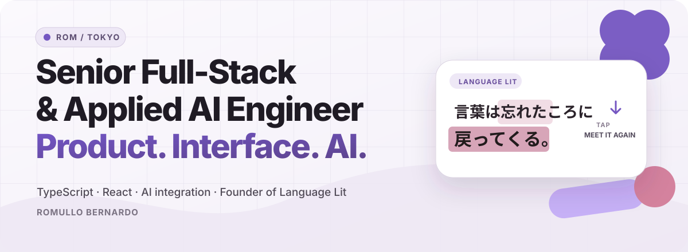
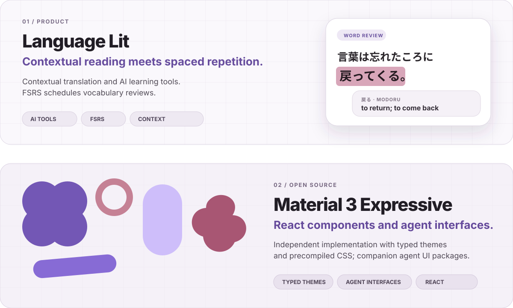
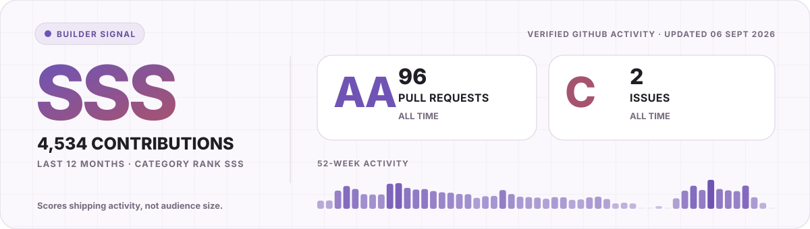

<picture>
  <source media="(max-width: 600px) and (prefers-color-scheme: dark)" srcset="./assets/hero-mobile-dark.svg">
  <source media="(max-width: 600px)" srcset="./assets/hero-mobile-light.svg">
  <source media="(prefers-color-scheme: dark)" srcset="./assets/hero-dark.svg">
  <source media="(prefers-color-scheme: light)" srcset="./assets/hero-light.svg">
  
</picture>

I partner with founders and lean product teams to turn complex software ideas into polished production releases. I own the path from product clarity and interaction design to architecture and implementation, so there are fewer handoffs and good ideas survive contact with real code.

Based in Tokyo. Currently building Language Lit and open-source interface systems.

## Selected work

<picture>
  <source media="(max-width: 600px) and (prefers-color-scheme: dark)" srcset="./assets/work-mobile-dark.svg">
  <source media="(max-width: 600px)" srcset="./assets/work-mobile-light.svg">
  <source media="(prefers-color-scheme: dark)" srcset="./assets/work-dark.svg">
  <source media="(prefers-color-scheme: light)" srcset="./assets/work-light.svg">
  
</picture>

**[Language Lit](https://language-lit.com)** is a language-learning product I designed and built around one behavior: tap a word once, then meet it again inside whatever you read next. It combines contextual meaning across 33 languages with real FSRS scheduling while keeping the experience quiet and immediate.

**[Material 3 Expressive](https://m3e.language-lit.com)** turns a complex design specification into a production-ready React system. I built 41 conformant components with typed theme and token APIs, precompiled CSS, and zero runtime dependencies. **[View the source →](https://github.com/Language-Lit/material3-expressive)**

## Shipping signal

<a href="./docs/builder-signal.md">
  <picture>
    <source media="(max-width: 600px) and (prefers-color-scheme: dark)" srcset="./assets/builder-signal-mobile-dark.svg">
    <source media="(max-width: 600px)" srcset="./assets/builder-signal-mobile-light.svg">
    <source media="(prefers-color-scheme: dark)" srcset="./assets/builder-signal-dark.svg">
    <source media="(prefers-color-scheme: light)" srcset="./assets/builder-signal-light.svg">
    
  </picture>
</a>

<a href="./docs/builder-signal.md">How the category ranks work →</a>

## Building something difficult?

I work best on products where interaction quality and production architecture have to be solved together. If you need one product partner who can turn ambiguity into a clear interface and a system ready to ship, **[let’s talk →](https://www.linkedin.com/in/romullo-bernardo/)**

  <a href="https://language-lit.com">Language Lit</a>
  &nbsp;·&nbsp;
  <a href="https://m3e.language-lit.com">M3E documentation</a>
  &nbsp;·&nbsp;
  <a href="https://www.linkedin.com/in/romullo-bernardo/">LinkedIn</a>

